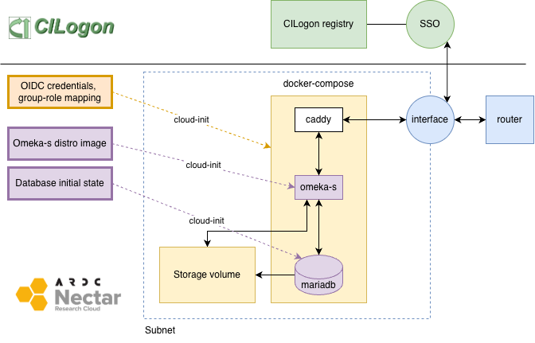
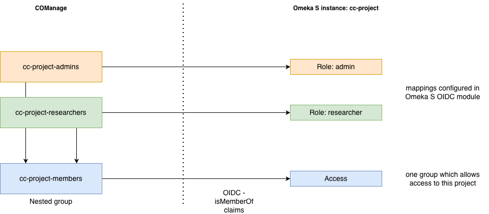
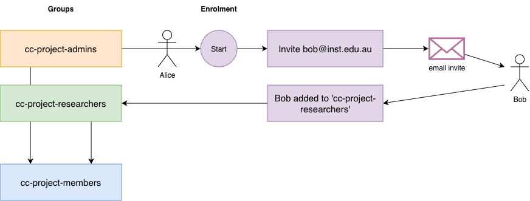

# Curated Collections Deploy Scripts

This is a Terraform module to install the Curated Collections
distribution of Omeka S to Nectar via its OpenStack API.

## What the module does

The module creates the following on Nectar:

- a network
- a subnet
- a router
- a compute instance
- a fixed IP attached to the compute instance
- a DNS record for ${project}.curated-collections.cloud.edu.au pointing at the IP

The compute instance is configured with [cloud-init](https://cloud-init.io/) - this is a cross-platform system for initialising and configuring cloud servers.

The basis for this is a cloud-init.yaml which the Terraform module
populates and copies to the new instance. Cloud-init works by default
on all Nectar instances, and it uses the contents of the
cloud-init.yaml file to set up the following:

- a docker-compose.yml file which refers to the Omeka S and MariaDB image in the [Nectar container registry](https://registry.rc.nectar.org.au/)
- a Caddyfile which does TLS termination for the project URL
- a bunch of initial values for the Omeka S app, like the local
 admin user credentials, the project and site title etc (see the Configuration section below for a full list)
- The OIDC config. Some of these are project-specific: the CILogon groups which define who can access the instance backend and mappings to Omeka S roles. Some are not (the OICD client ID and secret). Full details are in the configuration section below. 

To plan the installation, run

    > terraform plan

To apply the installation, run

    > terraform apply

To destroy the installation, run

    > terraform destroy

WARNING: this setup doesn't export data before tearing down the build,
so 'destroy' really means destroy: any data which has been added to
the server will be lost for good. See the Todo section.

## Configuration

### variables.tf

Global config values which aren't secrets

- cc_domain - the base domain for Curated Collections

### openstack-variables.tf

Global config values - some of these are secret so the file is
in .gitignore

- openstack_user
- openstack_password
- nectar_project_id
- nectar_project_name

### project-variables.tf

Project-specific config

- cc_project_id - a unique string for this project in Curated Collections, will be used as the hostname as in  ${cc_project_id}.curated-collections.cloud.edu,au
- omeka_admin_email - email address for the local admin account
- omeka_admin_user - username for the local admin account
- omeka_project_title - the installation title
- omeka_site_title - the default public site title
- omeka_site_slug - the default public site's slug (url path)
- cilogon_group - a group on the Curated Collections CILogon registry - all members of this group will be allowed to log in to this instance
- oidc_roles_map - a mapping from CILogon groups to Omeka S roles. See the OIDC section below for details
- oidc_hide_local_login - a boolean indicating whether local authentication should be hidden.

## Secrets

The Terraform module generates random passwords for the database (used
when the Omeka S container communicates with MariaDB) and for the
local admin user.

You can get the local admin password with the command

    > terraform output -raw omeka_admin_password

You shouldn't need to use the db passwords, but you can get them using the same command with db_password or db_root_password as the second argument.

## OIDC

Most Omeka S instances have three groups in CILogin:

- a group of admin users (typically the CI)
- a group of regular users ("members")
- a group of all project members

The "all project members" group is a nested group to which users
are automatically added if they are a member of either the admin or
the members group. This gives us a single group to be used as the
way of controlling who gets to log in, without needing to keep it in
sync with the two subsets which control what level of privilege a
user will get.

Members join the CILogon groups by an enrolment workflow (set up by
the Curated Collections team when provisioning an instance) for the
instance. Anyone in the admin group can send an invite to enrol in
the team - when the user responds to the invite and joins, they are
assigned into the project members group.

Some project which want to allow self-enrolment for community
participants (ie without an admin inviting them) will require a third
group for self-enrolled users - this will map to an Omeka S role like
"author" which gives them fewer privileges (they can't delete or edit
other user's items)

# To do

- set up automated backups
- automatically dump out the database on teardown
- modify this so that we can have a single Caddy and IP in front of a set of Omeka S stacks on the same Nectar instance
