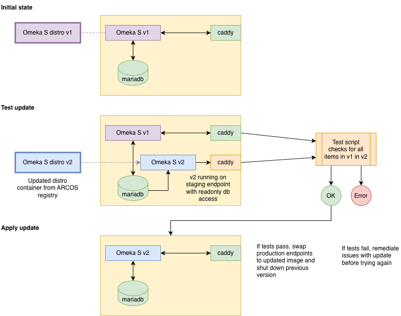

# Proposed update process

This update process covers the simplest case where no database migrations
are required, and where no local customisation of the Omeka S filesystem
(new modules or themes) have been installed.

The update process will be implemented as an extension to this
Terraform module.

The starting point is a docker-compose stack running on Nectar with an
existing omeka-s container image, being served via a Caddy image.

## Backup

A static dump of the SQL and file assets is made before updating.

## Deploy new image in test mode

The target image should be hosted on ARCOS. The docker-compose stack is
modified to start a new container running the new image. The new
image can access the production database in read-only mode, and is served
on a staging endpoint which is not publicly available.

## Automated testing of instance and site contents

Once the new container is running, an automated script verifies that every
item in the database is available in the new image via the API. The
script will also check that all items available in public site(s) on the
Omeka S instance are also available in public site(s) on the new image.

Later versions of the script may be able to test different visual
interfaces such as maps and node graphs - these are out of scope for the
first version.

## Go/no-go

If the automated tests pass, the update is applied:

- the updated image is given write access to the database
- the production caddy endpoint is swapped to serve the updated image
- where required, module records in the database are updated to match the installed versions in the image
- the old image is shut down

## Failed tests

If the automated tests fail, this indicates an issue with the updated
image which needs to be remediated before it can be reapplied.

## New modules

If the updated image includes modules which were not in the old image,
these will be available to admin users but won't be active, as they won't
have been added to the modules table in the database.

It may be desirable to automatically install some modules - this can be
added to the update application script which brings installed module
records up-to-date. This will be decided on a case-by-case basis when
preparing updated images.
